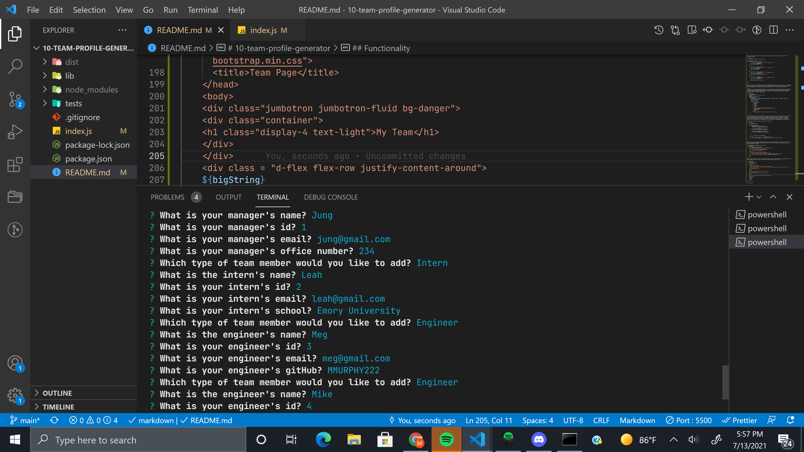
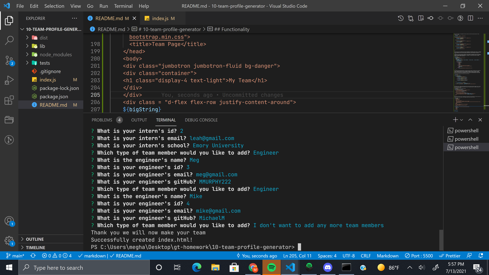
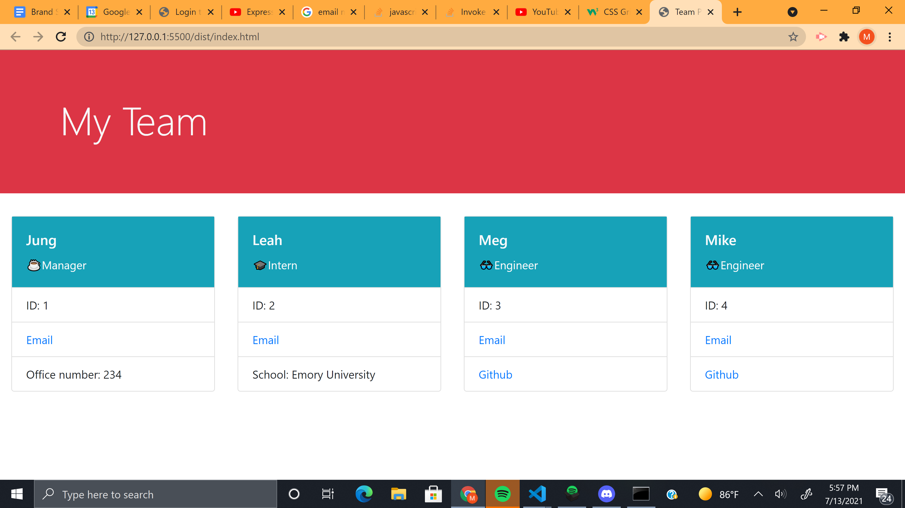

# 10-team-profile-generator

## User Story

```md
AS A manager
I WANT to generate a webpage that displays my team's basic info
SO THAT I have quick access to their emails and GitHub profiles
```
## Description
```md
This file takes user input with inquirer and creates an HTML file based on their responses.
```

## Functionality 

```md
There are four class constructors, three of which are extensions of the employee class constructor. The employee class looks like the following. 
```
```javascript
class Employee{
    constructor(namee, id, email) {
        this.name = namee;
        this.id = id;
        this.email = email;
    }

    getName() {
        return this.name;
    };

    getId() {
        return this.id;
    };

    getEmail() {
        return this.email;
    };

    getRole() {
        return "Employee";
    }
}

module.exports = Employee;
```

The constructor takes three parameters, name, id, and email. The functions are written to return the value requested. The Employee class is then exported with module.exports to be used by other classes and the test files.

```md
An example of a class extending Employee is as follows
```
```javascript
const Employee = require("./employee");

class Engineer extends Employee {
    constructor(namee, id, email, github) {
        super(namee, id, email);
        this.github = github;
    }

    getGithub() {
        return this.github;
    };

    getRole() {
        return "Engineer";
    }
}

module.exports = Engineer;
```
First, require is used to because employee is needed for the class extension. Engineer extends on Employee and adds GitHub, super is used to borrow the syntax for those parameters from the Employee. Engineer then adds an additional function of getGitHub allowing for it to be accessed, and also does the same module.exports to allow it to be referenced. All of the other three extension classes follow similar syntax. 

```md
Next came to writing tests. 
```
This is the syntax for the employee test and all other test files follow similar syntax for their respective classes. 

```javascript
const Employee = require("../lib/employee");

describe("employee test", () => {
    it("should return correct name", () => {
        const emp = new Employee("Mark", "2", "mark@gmail.com");
        const name = emp.getName();
        expect(name).toEqual("Mark");
    });

    it("should return correct id", () => {
        const emp = new Employee("Mark", "2", "mark@gmail.com");
        const id = emp.getId();
        expect(id).toEqual("2");
    });

    it("should return correct email", () => {
        const emp = new Employee("Mark", "2", "mark@gmail.com");
        const email = emp.getEmail();
        expect(email).toEqual("mark@gmail.com");
    });

    it("should return employee", () => {
        const emp = new Employee("Mark", "2", "mark@gmail.com");
        const role = emp.getRole();

        expect(role).toEqual("Employee")
    })

});
```

Each of the its are an individual test within the employee test description section. Each it is checking that each function returns the correct value. A new employee is created each time to allow the function to have something to pull from and the expected value is put in by us to show what it should be. 

```md
The index.js is where the inquirer prompts are run and the HTML is generated. There are three separate arrays of objects containing manager questions, intern questions, and engineer questions. Each ends with a prompt of choosing whether to add an intern, an engineer, or be done with the team. The manager question function is called on page load. 
```
```javascript
function managerQs() {
    console.log("Please build your team.")
    inquirer
    .prompt(managerQuestions)
    .then((answers) => {
        let manager = new Manager(`${answers.manName}`, `${answers.manId}`, `${answers.manEmail}`, `${answers.manOffice}`);
        team.push(manager);

        switch(answers.type) {
            case "Engineer":
                engQs();
                break;
            case "Intern":
                intQs();
                break;
            case "I don't want to add any more team members":
                console.log("Thank you we will now make your team");
                makeHTML(team);
                break;
            default:
                console.log("Something went wrong please start over");
        }
        
    })
```
This function prompts manager questions, and with the answers creates a new object that is then pushed into the empty team array. Then the switch statement runs based on the user's answer to the three choices. Different functions are run for each choice, engineer and intern are similar to manager questions as they prompt their respective questions and create a new object and push it to the team array. They also then have switch statements to allow for the use to continuously add to their team.

The make HTML function with the team array looks like this.

```javascript
function makeHTML(team) {

    team.forEach(element => {
        if(element.getRole() == "Manager") {
            bigString += makeManagerCard(element);

        } else if(element.getRole() == "Intern") {
            bigString += makeInternCard(element);

        } else if(element.getRole() == "Engineer") {
            bigString += makeEngineerCard(element);

        }
    })
        const HTMLPageContent = writeHTML();

    fs.writeFile('./dist/index.html', HTMLPageContent, (err) =>
            err ? console.log(err) : console.log('Successfully created index.html!')
        );
    }
```

The forEach loop is looking at each object within the team array and sorting it based on role. It then adds the respective function(which makes HTML syntax for bootstrap cards) to the empty string that is later placed into the HTML. 

The makeManagerCard function looks like this
```javascript
function makeManagerCard(manager){ 
    return `<div class="card my-style" style="width: 18rem;">
    <div class="card-body bg-info text-light">
      <h5 class="card-title">${manager.name}</h5>
      <p class="card-text">☕Manager</p>
    </div>
    <ul class="list-group list-group-flush">
      <li class="list-group-item">ID: ${manager.id}</li>
      <li class="list-group-item"><a href="mailto:${manager.email}">Email</a></li>
      <li class="list-group-item">Office number: ${manager.officeNumber}</li>
    </ul>
  </div>`
}
```
That function fills the correct information for each object into the bootstrap card syntax and then it is added to the whole HTML syntax in the writeHTML function. Which looks like this. 

```javascript
const writeHTML = () =>
    `<!DOCTYPE html>
    <html lang="en">
    <head>
      <meta charset="UTF-8">
      <meta http-equiv="X-UA-Compatible" content="ie=edge">
      <link rel="stylesheet" href="https://cdnjs.cloudflare.com/ajax/libs/twitter-bootstrap/4.5.0/css/bootstrap.min.css">
      <title>Team Page</title>
    </head>
    <body>
    <div class="jumbotron jumbotron-fluid bg-danger">
    <div class="container">
    <h1 class="display-4 text-light">My Team</h1>
    </div>
    </div>
    <div class = "d-flex flex-row justify-content-around">
    ${bigString}
    </div>
    <footer>
    </footer>
    </body>`;
```
## Video Link
https://drive.google.com/file/d/1nyYdJvguBRsth81equLONRJZ2OTGPGb7/view
## Screenshots




